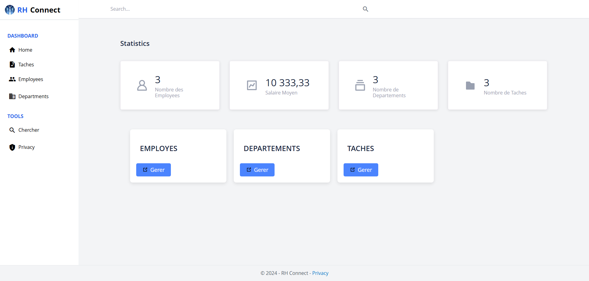

<a id="readme-top"></a>

<!-- PROJECT LOGO -->
<br />
<div align="center">

  <h3 align="center">Rhconnect</h3>

  <p align="center">
    A human resources management system built using the .NET framework to manage employees, departments, and tasks efficiently.
  </p>
</div>

<!-- TABLE OF CONTENTS -->
<details>
  <summary>Table of Contents</summary>
  <ol>
    <li>
      <a href="#about-the-project">About The Project</a>
      <ul>
        <li><a href="#built-with">Built With</a></li>
      </ul>
    </li>
    <li><a href="#screenshots">Screenshots</a></li>
    <li>
      <a href="#getting-started">Getting Started</a>
      <ul>
        <li><a href="#prerequisites">Prerequisites</a></li>
        <li><a href="#installation">Installation</a></li>
      </ul>
    </li>
    <li><a href="#contact">Contact</a></li>
  </ol>
</details>

<!-- ABOUT THE PROJECT -->
## About The Project

<a href="https://github.com/Hamza-Alali-0/Rhconnect">
    
</a>

RHConnect is a human resources management system built using the .NET framework. The platform is designed to manage employees, departments, and tasks efficiently. The primary objective is to streamline HR processes, improve communication, and provide a centralized system for managing the workforce, enabling quicker decision-making and better resource allocation.

Here's why RHConnect stands out:
- **Centralized HR Management**: Simplifies employee tracking, task assignment, and department management.
- **Efficient Task Management**: Enhances productivity by streamlining task allocation and tracking.
- **Improved Communication**: Facilitates better collaboration between employees and HR departments.

RHConnect aims to revolutionize HR management by optimizing operations, enhancing communication, and providing a centralized system for workforce management.

### Built With

This project is built with the following technologies:

* [![.NET][.NET.com]][.NET-url]
* [![SQL Server][SQLServer.com]][SQLServer-url]
* [![HTML][HTML.com]][HTML-url]
* [![CSS][CSS.com]][CSS-url]

<!-- Reference-style links for images -->
[.NET.com]: https://img.shields.io/badge/.NET-512BD4?style=for-the-badge&logo=dotnet&logoColor=white
[.NET-url]: https://dotnet.microsoft.com/
[SQLServer.com]: https://img.shields.io/badge/SQL%20Server-CC2927?style=for-the-badge&logo=microsoft-sql-server&logoColor=white
[SQLServer-url]: https://learn.microsoft.com/en-us/sql/ssms/sql-server-management-studio-ssms?view=sql-server-ver16
[HTML.com]: https://img.shields.io/badge/HTML-E34F26?style=for-the-badge&logo=html5&logoColor=white
[HTML-url]: https://developer.mozilla.org/en-US/docs/Web/HTML
[CSS.com]: https://img.shields.io/badge/CSS-1572B6?style=for-the-badge&logo=css3&logoColor=white
[CSS-url]: https://developer.mozilla.org/en-US/docs/Web/CSS

<p align="right">(<a href="#readme-top">back to top</a>)</p>

<!-- SCREENSHOTS -->
## Screenshots

Here are some screenshots of the project:

| ![Home Page][home-screenshot] | ![Admin Page][admin-screenshot] | ![Login Page][login-screenshot] |
|-------------------------------|----------------------------------|----------------------------------|
| **Home Page**                 | **Admin Page**                  | **Login Page**                  |

<!-- Reference-style links for images -->
[home-screenshot]: Assets/details.png
[admin-screenshot]: Assets/employes.png
[login-screenshot]: Assets/Taches.png

<p align="right">(<a href="#readme-top">back to top</a>)</p>

<!-- GETTING STARTED -->
## Getting Started

To get a local copy up and running, follow these simple steps.

### Prerequisites

Before you begin, ensure you have the following installed:
- [Visual Studio](https://visualstudio.microsoft.com/) (with .NET framework support)
- [SQL Server Management Studio (SSMS)](https://learn.microsoft.com/en-us/sql/ssms/download-sql-server-management-studio-ssms?view=sql-server-ver16) (for database management)
- A modern web browser (e.g., Chrome, Firefox)

### Installation

1. **Install Visual Studio**:
   - Download and install Visual Studio from the [official website](https://visualstudio.microsoft.com/).
   - Ensure the .NET framework is installed and configured.

2. **Install SQL Server Management Studio (SSMS)**:
   - Download and install SSMS from the [official website](https://learn.microsoft.com/en-us/sql/ssms/download-sql-server-management-studio-ssms?view=sql-server-ver16).
   - Set up your SQL Server database and configure the connection string in the project.

3. **Clone the repository**:
   ```sh
   git clone https://github.com/Hamza-Alali-0/Rhconnect.git

4. **Replace Database connection string in Appsettings.json**:
 - Example:     "ConnectionDb": "Data Source=<strong>your-connection-string<strong>\\SQLEXPRESS; Database=GestionEmployees; Integrated Security=True".

- Make migrations !.


<a id="contact"></a>
## Contact

Hamza Alali - [hamza.alali.dev@gmail.com](mailto:hamza.alali.dev@gmail.com)


Connect with me:
- <a href="https://dev.to/@hamzaalali0" target="_blank"></a>
- <a href="https://www.linkedin.com/in/hamza--alali" target="_blank"></a>
- <a href="https://github.com/hamza-alali-0" target="_blank"></a>
- <a href="https://www.instagram.com/alalihamza.0/" target="_blank"></a>

Project Link: [https://github.com/Hamza-Alali-0/Rhconnect](https://github.com/Hamza-Alali-0/Rhconnect)

<p align="right">(<a href="#readme-top">back to top</a>)</p>
   

   
